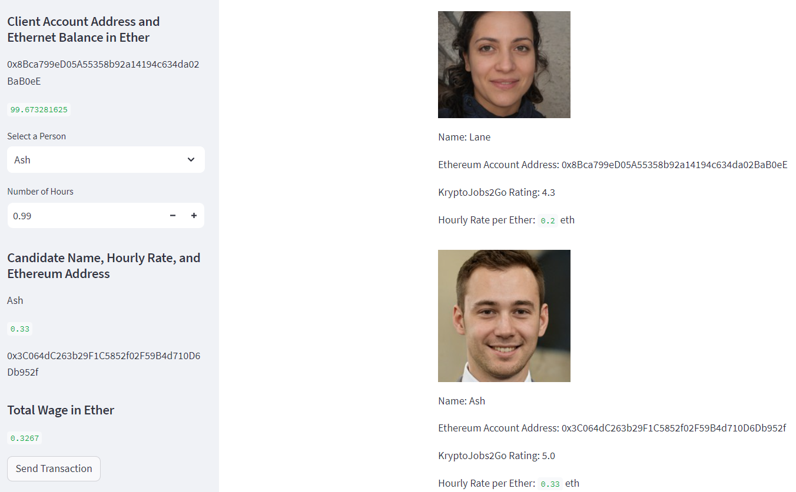
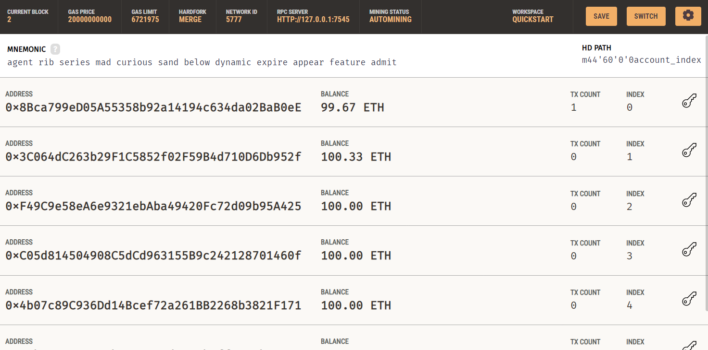
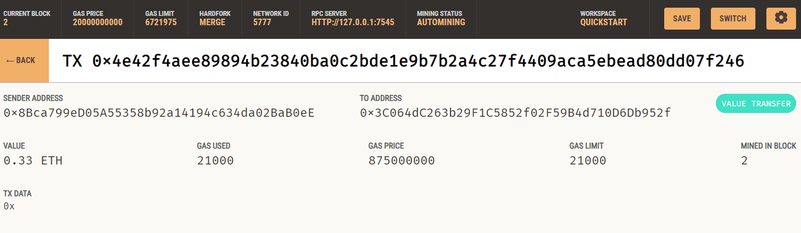

## Unit 19 Homework: Cryptocurrency Wallet

#Installation Gudie/ Imports

import streamlit as st
from dataclasses import dataclass
from typing import Any, List
from web3 import Web3
import os
import requests
from dotenv import load_dotenv
load_dotenv()
from bip44 import Wallet
from web3 import Account
from web3 import middleware
from web3.gas_strategies.time_based import medium_gas_price_strategy

